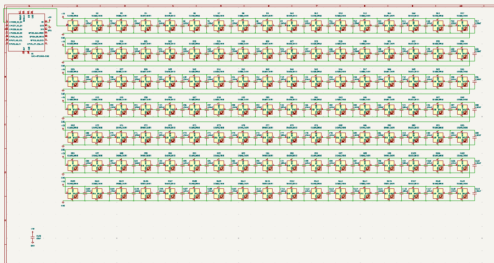
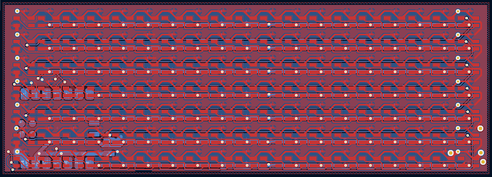

# pixelClock

[https://wokwi.com/projects/429875870626598913](https://wokwi.com/projects/429875870626598913)

⚠️ I would like to solder way more than 50 neopixels and a bunch of caps, so I would need a hotplate.

This is a grid of SK6821MINI leds. It is designed mainly to be used as a clock, but the surrounding leds could also be used for other things, and I'm planning on adding a alarm with a webpage later.

BOM

|   Comment     |   Footprint                                   |   Quantity    |   LCSC        |   Price   |
|---------------|-----------------------------------------------|---------------|---------------|-----------|
|   100nF       |   C_0201_0603Metric_Pad0.64x0.40mm_HandSolder |   133         |   C30926      |   $0.44   |
|   10uF        |   C_1210_3225Metric_Pad1.33x2.70mm_HandSolder |   1           |   C7432790    |   $0.38   |
|               |   XIAO-RP2040-DIP                             |   1		    |               |           |
|   Neopixel    |  	SK6812MINI                                  |   133		    |               |           |

Some images of your design (make sure to include both the PCB and Schematic!):

