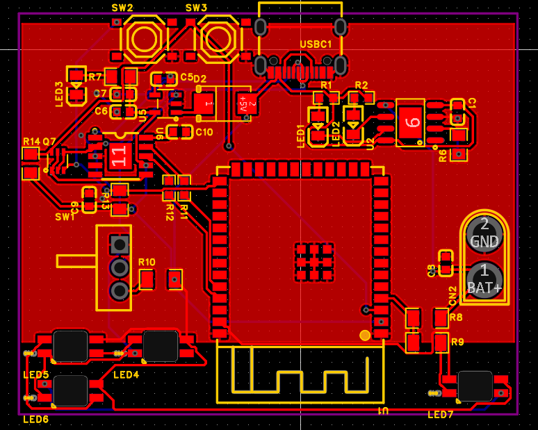
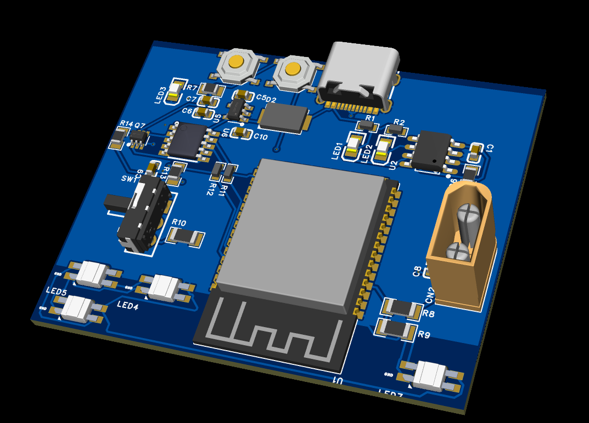

# YOUR PROJECT NAME

Replace the wokwi link below with yours

Wokwi link: [https://wokwi.com/projects/428170537247928321](https://wokwi.com/projects/428170537247928321)

<!-- Uncomment the line below if you need a soldering iron -->
<!-- ⚠️ I would like to [reason for iron], so I would need a soldering iron. -->

Simple leds with a lipo charger. Has accelerometer and 4 moter controllers. 

A simplified BOM table
No.	Quantity	Comment	Designator	Footprint	Value	Manufacturer Part	Manufacturer	Supplier Part	Supplier
1	5	1uF	C1,C5,C6,C9,C10	C0603	1uF	CL10A105KB8NNNC	SAMSUNG(三星)	C15849	LCSC
2	2	10uF	C7,C8	C0603	10uF	CL10A106KP8NNNC	SAMSUNG(三星)	C19702	LCSC
3	1	XT30U-M	CN2	CONN-TH_XT30U-M		XT30U-M	AMASS(艾迈斯)	C99101	LCSC
4	1	SS54B	D2	SMB_L4.6-W3.6-LS5.3-RD		SS54B	MDD(辰达半导体)	C32513	LCSC
5	2	NCD0805R1	LED1,LED3	LED0805-R-RD		NCD0805R1	国星光电	C84256	LCSC
6	1	KT-0805G	LED2	LED0805-R-RD		KT-0805G	KENTO	C2297	LCSC
7	4	SK6812MINI-E	LED4,LED5,LED6,LED7	LED-SMD_L3.2-W2.8-LS5.9_SK6812MINI-E		SK6812MINI-E	欧思科光电	C5149201	LCSC
8	1	2N7002DW	Q7	SOT-363_L2.0-W1.3-P0.65-LS2.1-BL		2N7002DW	YANGJIE(扬杰)	C699281	LCSC
9	4	1kΩ	R1,R2,R11,R12	R0603	1kΩ	RC0603JR-071KL	YAGEO(国巨)	C14676	LCSC
10	1	2kΩ	R6	R0805	2kΩ	0805W8F2001T5E	UNI-ROYAL(厚声)	C17604	LCSC
11	1	470Ω	R7	R0805	470Ω	0805W8F4700T5E	UNI-ROYAL(厚声)	C17710	LCSC
12	3	100kΩ	R8,R9,R10	R1206	100kΩ	1206W4F1003T5E	UNI-ROYAL(厚声)	C17900	LCSC
13	2	10kΩ	R13,R14	R0805	10kΩ	0805W8F1002T5E	UNI-ROYAL(厚声)	C17414	LCSC
14	1	K3-1260D-L1	SW1	SW-TH_K3-1260D-L1		K3-1260D-L1	韩国韩荣	C92657	LCSC
15	2	TS-1187A-B-A-B	SW2,SW3	SW-SMD_4P-L5.1-W5.1-P3.70-LS6.5-TL_H1.5		TS-1187A-B-A-B	XKB Connectivity(中国星坤)	C318884	LCSC
16	1	ESP32-S3-WROOM-1-N8R8	U1	WIRELM-SMD_ESP32-S3-WROOM-1		ESP32-S3-WROOM-1-N8R8	ESPRESSIF(乐鑫)	C2913201	LCSC
17	1	TP4056	U2	ESOP-8_L4.9-W3.9-P1.27-LS6.0-BL-EP-1		TP4056	HXY MOSFET(华轩阳电子)	C17702041	LCSC
18	1	SPX3819M5-L-3-3/TR	U5	SOT-23-5_L3.0-W1.7-P0.95-LS2.8-BL		SPX3819M5-L-3-3/TR	MaxLinear(迈凌)	C9055	LCSC
19	1	CH340K	U6	ESOP-10_L4.9-W3.9-P1.00-LS6.2-BL-EP		CH340K	WCH(南京沁恒)	C968586	LCSC
20	1	TYPE-C-31-M-12	USBC1	USB-C_SMD-TYPE-C-31-M-12		TYPE-C-31-M-12	韩国韩荣	C165948	LCSC

<!-- Example:

| Comment           | Footprint                                      | Quantity | LCSC     | Cost   |
|-------------------|------------------------------------------------|----------|----------|--------|
| 100uF             | C_1206_3216Metric_Pad1.33x1.80mm_HandSolder    | 1        | C15008   | 0.0682$|
| 4.7nF             | C_0402_1005Metric_Pad0.74x0.62mm_HandSolder    | 3        | C1538    | 0.0011$|
| WS2812B           | LED_WS2812B_PLCC4_5.0x5.0mm_P3.2mm             | 9        |          |
| XIAO-RP2040-DIP   | XIAO-RP2040-DIP                                | 1        |          |
| Cherry MX         | SW_Cherry_MX_1.00u_PCB                         | 2        |          | 6.48$ for 8, 1.62$ for 2 |
 -->

I first figuerd out what parts I would need and found them on lcsc.

