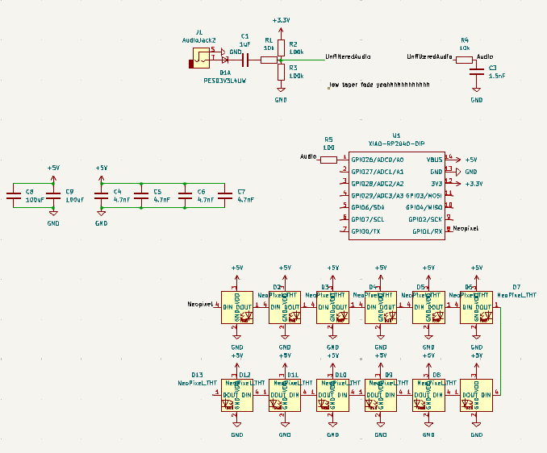
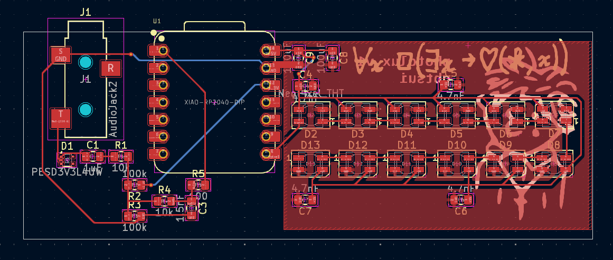
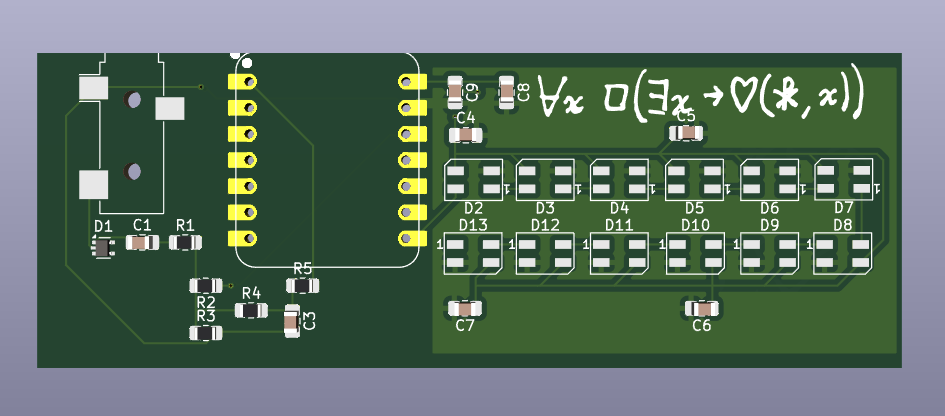

# photolux
created by: Gabriel Tsui [gbtsui] (slack id: U082VP0QX46)

[wokwi](https://wokwi.com/projects/428224523908486145)

I made a simple audio visualizer that takes input from a mono audio jack and flashes colors. It's pretty cool!

## BOM
<!-- Example: -->

| Comment               | Footprint                                               | Quantity | LCSC     | Cost     |
|------------------------|---------------------------------------------------------|----------|----------|----------|
| 100K resistor          | R_0805_2012Metric_Pad1.20x1.40mm_HandSolder              | 2        | C96346   |          |
| Surface mounted Neopixel | LED_SK6812MINI_PLCC4_3.5x3.5mm_P1.75mm                  | 12       |          |          |
| 4.7nF cap              | C_0805_2012Metric_Pad1.18x1.45mm_HandSolder              | 4        | C98192   |          |
| XIAO-RP2040-DIP        | XIAO-RP2040-DIP                                          | 1        |          |          |
| 100uF cap              | C_0805_2012Metric_Pad1.18x1.45mm_HandSolder              | 2        | C141660  |          |
| STX-3000 Audio Jack    | Jack_3.5mm_CUI_SJ-3523-SMT_Horizontal                    | 1        |          |          |
| 10K resistor           | R_0805_2012Metric_Pad1.20x1.40mm_HandSolder              | 2        | C84376   |          |
| 100Ω resistor          | R_0805_2012Metric_Pad1.20x1.40mm_HandSolder              | 1        | C105577  |          |
| 1uF decoupling cap     | C_0805_2012Metric_Pad1.18x1.45mm_HandSolder              | 1        | C28323   |          |
| Surge Protection Chip  | SOT-665                                                 | 1        | C552518  |          |
| 1.5nF cap              | C_0805_2012Metric_Pad1.18x1.45mm_HandSolder              | 1        | C541572  |          |

Design was honestly really hard. Originally I wanted to do baremetal but then i realized how difficult that would be to route and debug. So eventually I switched to my current design and finished it in like 5 hours. I then proceeded to forget about this for 3 weeks before submitting it properly.

