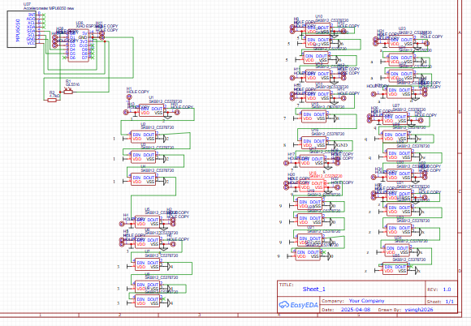

# Skateboard Backlight

No wowki link, too complex

This project is a skateboard backlight system that uses a photoresistor to adjust the brightness of the lights based on ambient light and an accelerometer to detect motion or tilt for dynamic lighting effects. The system is powered by a XIAO microcontroller and includes addressable LEDs for customizable lighting patterns.

A simplified BOM table
(pls include rough pricing of any extra components you're using)

| Comment           | Footprint                                      | Quantity | LCSC     | Cost   |
|-------------------|------------------------------------------------|----------|----------|--------|
| 4.7kΩ             | C_1206_3216Metric_Pad1.33x1.80mm_HandSolder    | 1        | C15008   | 0.0682$|
| WS2812B-5050      | LED_WS2812B_PLCC4_5.0x5.0mm_P3.2mm             | 35        |          |
| XIAO ESP32C3      | XIAO ESP32C3                                   | 1        |          |
| Photoresistor     | GL5516                                         | 1        | C125626  | 0.049$ |
| Accelerometer     | ACCELEROMETER MPU6050                          | 1        |          |will get myself

Tell us a little bit about your design process. What were some challenges? What helped?

The design process involved integrating a photoresistor and an accelerometer with the XIAO microcontroller to create a responsive lighting system. One challenge was calibrating the photoresistor to ensure accurate brightness adjustments in varying light conditions. The accelerometer required careful tuning to detect motion and tilt without false triggers. Using simulation tools like Wokwi and referencing datasheets helped streamline the process.

Some images of your design (make sure to include both the PCB and Schematic!):

